<div align="center">
  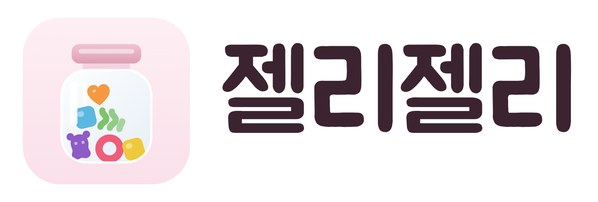
  <p><b>먹은 젤리를 병에 담아 모으는 기록장</b></p>
  <p>
    <a href="https://jellyjelly.vercel.app">jellyjelly.vercel.app</a> ·
    <a href="https://jellyjelly.vercel.app/manual/">설명서</a>
  </p>
</div>

---

독서기록 앱 *북적북적*이 읽은 책을 쌓아 올리듯, 먹은 젤리를 쌓아 올린다.
달마다 유리병이 하나씩 생기고, 하나 먹을 때마다 알맹이가 병 안으로 떨어진다.
달이 끝나면 그 병은 선반에 남는다.

기록과 사진은 전부 기기 안(IndexedDB)에 있다. 서버는 선택이다.

<br>

## 화면

### 선반과 병

<table>
<tr>
<td width="33%">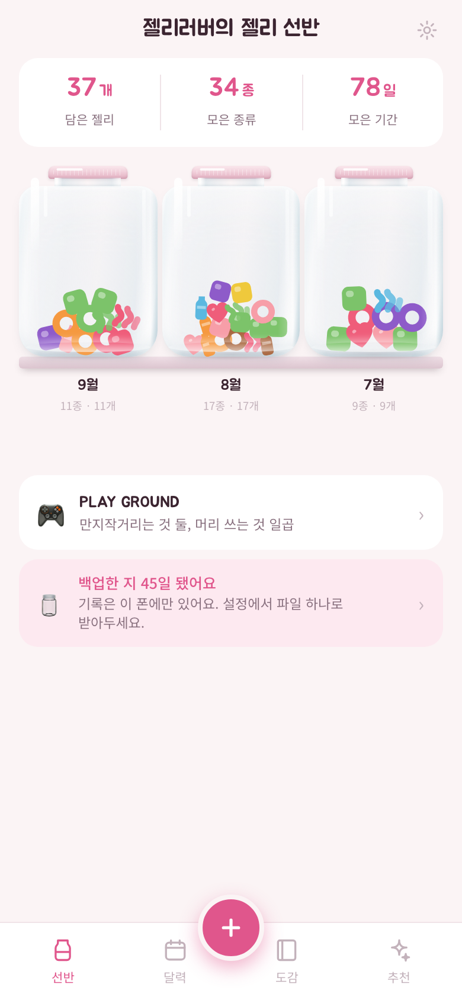</td>
<td width="33%">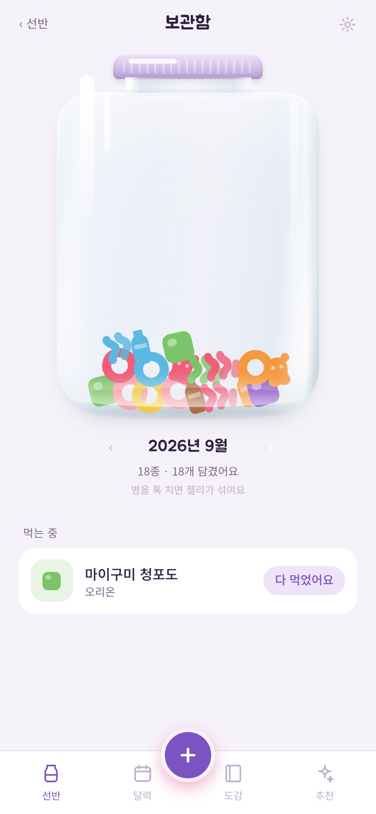</td>
<td width="33%">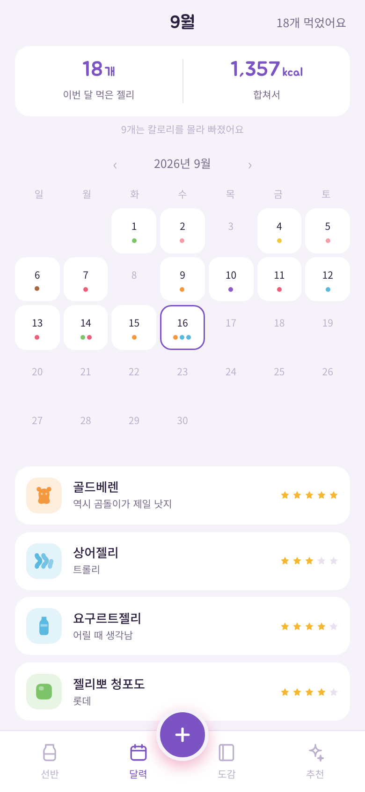</td>
</tr>
<tr>
<td><b>젤리 선반</b> — 첫 화면. 지금까지의 병이 최신 순으로 놓인다. 아무것도 안 먹은 달도 빈 병으로 남아서 쉰 달이 보인다.</td>
<td><b>달 보관함</b> — 그 달의 병 하나를 크게. 병을 톡 치면 젤리가 실제로 섞이고 소리가 난다. 알맹이를 누르면 그때의 기록이 뜬다.</td>
<td><b>달력</b> — 먹은 날에 젤리 색 점이 찍힌다. 위에는 이번 달 개수와 칼로리 합계, 날짜를 누르면 그날 목록.</td>
</tr>
</table>

### 기록하기

<table>
<tr>
<td width="33%">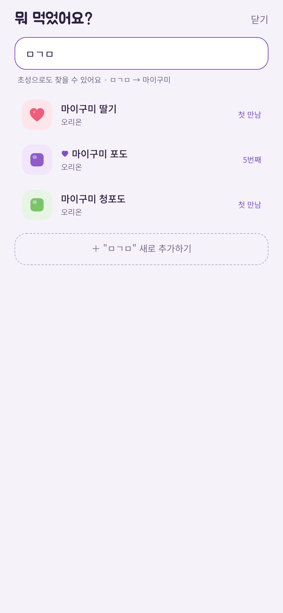</td>
<td width="33%">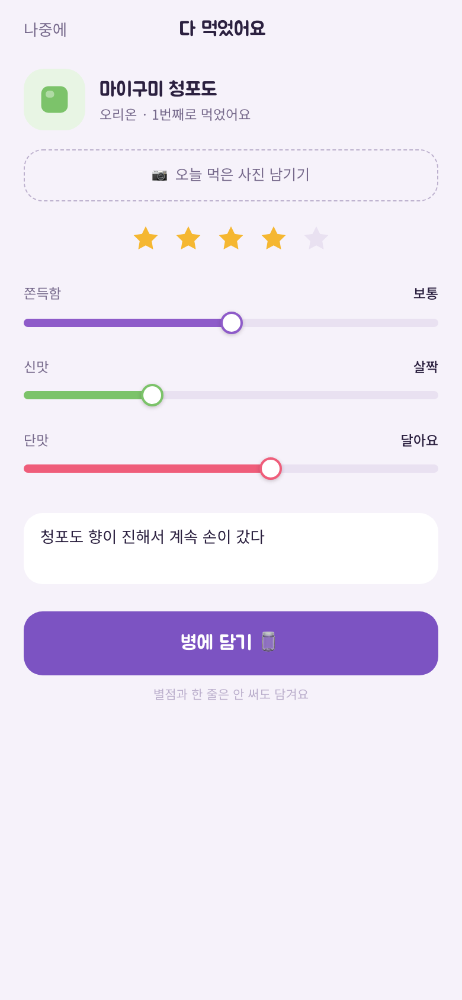</td>
<td width="33%">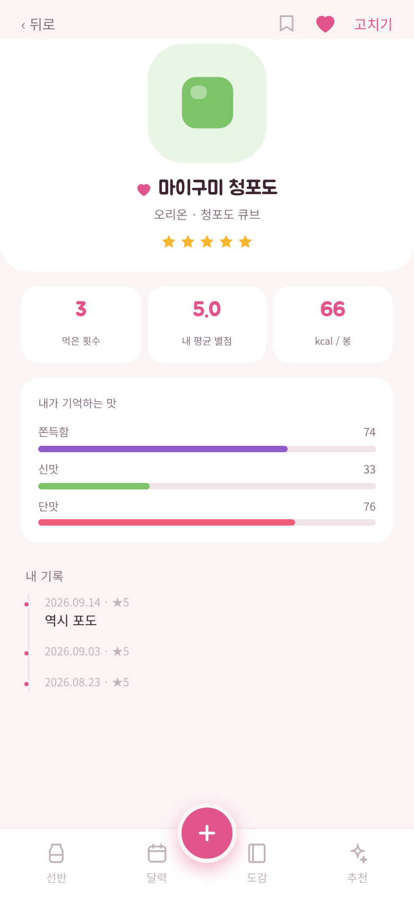</td>
</tr>
<tr>
<td><b>젤리 고르기</b> — 가운데 <code>+</code> 버튼. 초성으로 찾는다(ㅁㄱㅁ → 마이구미). 목록에 없으면 그 자리에서 새로 추가.</td>
<td><b>다 먹었어요</b> — 오늘 찍은 사진, 별점, 식감 슬라이더 셋, 한 줄. 전부 건너뛰어도 담긴다. 담으면 알맹이가 병으로 떨어진다.</td>
<td><b>젤리 상세</b> — 먹은 횟수, 내 평균 별점, 칼로리, 내가 기억하는 맛, 기록 타임라인. 하트를 누르면 최애, 책갈피를 누르면 찜.</td>
</tr>
</table>

### 모으기

<table>
<tr>
<td width="33%">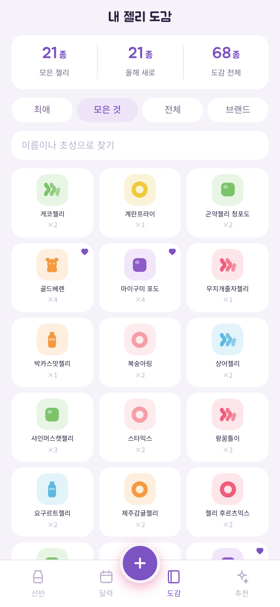</td>
<td width="33%">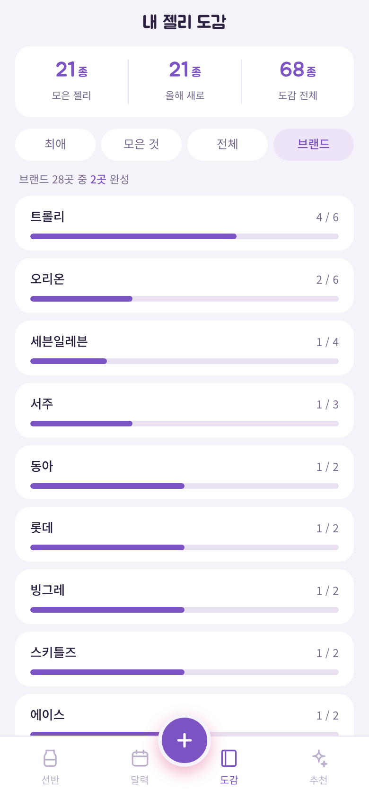</td>
<td width="33%">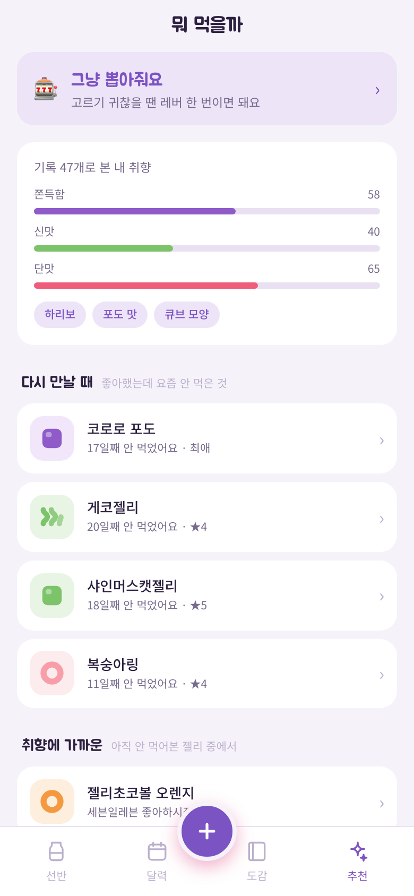</td>
</tr>
<tr>
<td><b>도감</b> — 편의점 젤리 68종이 기본으로 깔려 있다. 안 먹어본 것은 흐리게. 최애 / 모은 것 / 전체로 나눠 본다.</td>
<td><b>브랜드 수집률</b> — 브랜드마다 몇 종 중 몇 종. 한 칸 남은 브랜드가 위로 오게 정렬한다. 막대를 누르면 그 브랜드만 남는다.</td>
<td><b>추천</b> — 외부 데이터 없이 내 기록만으로. 맨 위에 찜해둔 것, 취향 프로필, 좋아했는데 요즘 안 먹은 것, 취향에 가까운 새 젤리.</td>
</tr>
</table>

### 심심할 때

<table>
<tr>
<td width="33%">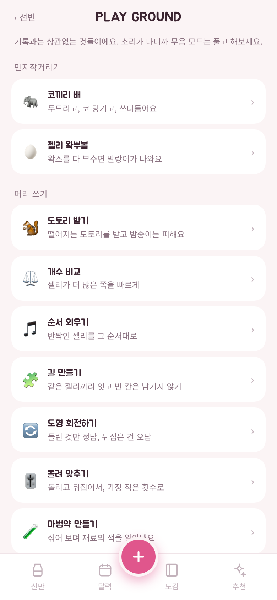</td>
<td width="33%">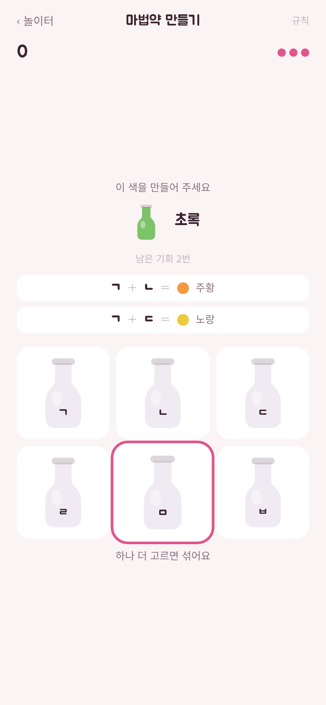</td>
<td width="33%">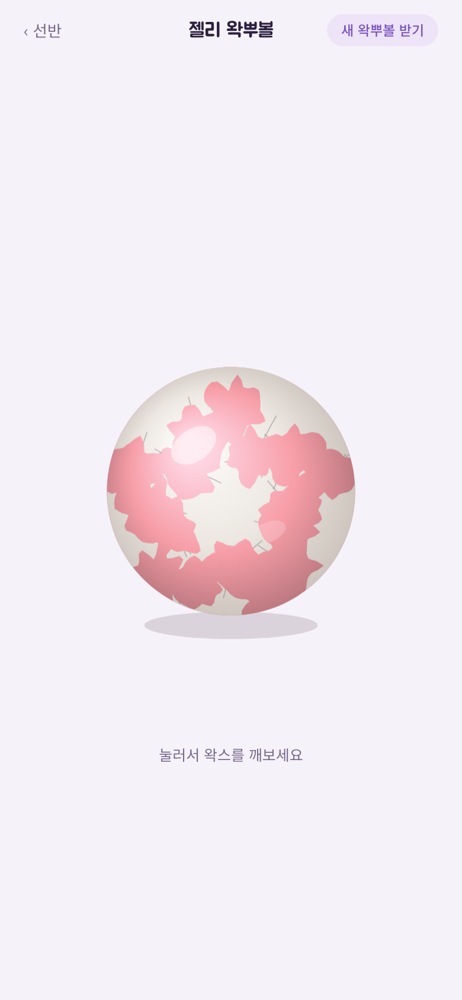</td>
</tr>
<tr>
<td><b>PLAY GROUND</b> — 선반 아래 입구로 들어간다. 만지작거리는 것 둘과 머리 쓰는 게임 일곱을 찾아오는 마음으로 갈라 놓고, 기록이 남는 것은 줄 오른쪽에 최고 기록을 같이 보여준다.</td>
<td><b>마법약 만들기</b> — 약병 여섯의 색을 안 알려준다. 둘을 섞은 색만 보고 각 병의 색을 거꾸로 알아낸다. 적게 섞을수록 점수가 높다.</td>
<td><b>젤리 왁뿌볼</b> — 매끈한 왁스를 누른 자리부터 파삭 깨나간다. 깨는 동안에도 누르면 들어가고 당기면 늘어난다. 다 벗기면 말랑이가 된다.</td>
</tr>
</table>

### 설정

<table>
<tr>
<td width="33%">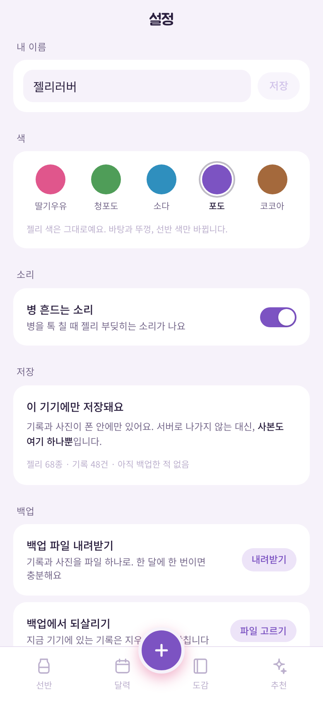</td>
<td width="33%">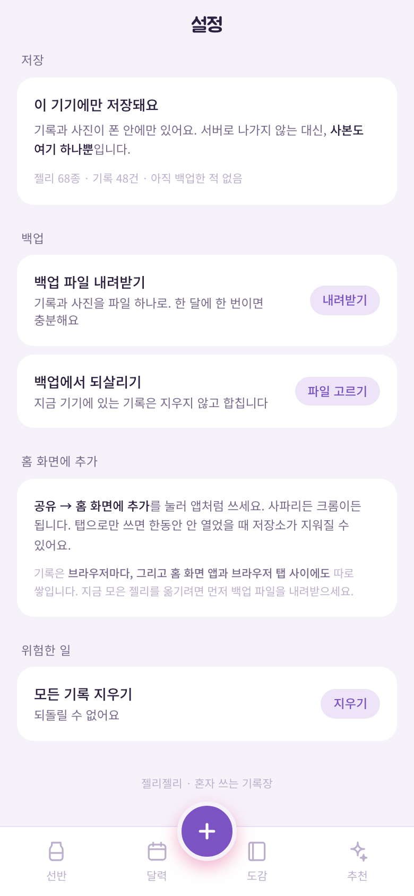</td>
<td width="33%" valign="top"><br><b>설정</b> — 닉네임, 테마 5색(딸기우유·청포도·소다·포도·코코아), 병 흔드는 소리 끄기.<br><br><b>백업</b> — 기록과 사진을 파일 하나로 내려받고, 되살릴 때는 지금 기기 것을 지우지 않고 합친다.<br><br>지금 기록이 어디에 담기고 있는지(브라우저 탭인지 홈 화면 앱인지)도 여기서 알려준다.</td>
</tr>
</table>

<br>

## 홈 화면에 추가하기

브라우저 탭으로도 되지만, 홈 화면에 추가해야 주소창 없이 앱처럼 열리고
한동안 안 열어도 저장소가 안 지워진다.

아이폰에는 **앱 안에 추가 버튼을 만들 수 없다.** 웹에 그 API가 없다 - 공유 시트를 열
방법도, 홈 화면에 무언가를 꽂을 방법도 애플이 안 열어줬다. 그래서 설정 화면은
버튼 대신 어디를 눌러야 하는지 그 자리의 그림으로 짚어준다.

**아이폰 (사파리)** — 아래 가운데 **공유** 버튼 → **홈 화면에 추가** → 추가

**아이폰 (크롬·엣지·파이어폭스)** — iOS 16.4부터는 여기서도 된다. 주소창 옆 **공유**
(또는 ⋮ 안의 공유) → **홈 화면에 추가**. 사파리로 옮길 필요 없다.
카카오톡·인스타그램 안에서 열린 창만 안 되고, 그때는 Safari로 열기를 한 번 거친다.

**안드로이드 (크롬)** — 오른쪽 위 ⋮ → **앱 설치** 또는 **홈 화면에 추가**

> 브라우저마다, 그리고 홈 화면 앱과 브라우저 탭 사이에도 기록이 **따로** 쌓인다.
> 사파리 탭에서 모으다가 홈 화면 앱으로 옮기면 빈 병으로 시작한다.
> 옮기기 전에 **설정 → 백업 파일 내려받기**로 챙긴다.

<br>

## 만든 것

| 화면 | 하는 일 |
|---|---|
| 젤리 선반 (홈) | 지난 병들을 한 화면에. 빈 달도 빈 병으로 남는다 |
| 달 보관함 | 달 단위 유리병, 젤리를 누르면 그 기록, 병 흔들기(소리 포함), 폰을 기울이면 쏠림, 먹는 중 목록 |
| 기록하기 | 초성 검색으로 찾아 한 번 탭 |
| 젤리 추가/수정 | 이름만 필수. 사진·모양·색 |
| 다 먹었어요 | 그날 찍은 사진 + 별점 + 식감 슬라이더 3종 + 한 줄, 그리고 병에 떨어지는 연출 |
| 젤리 상세 | 최애 표시, 먹은 횟수, 평균 별점, 식감 평균, 기록 타임라인 |
| 달력 | 날짜별 젤리 색 점, 이번 달 칼로리 합계, 날짜를 누르면 그날 기록 |
| 도감 | 최애 / 모은 것 / 전체 / 브랜드별 수집률, 카드 그리드, 검색, 찜 표시 |
| 추천 | 내 기록만으로 - 찜해둔 것, 취향 프로필, 다시 만날 때, 취향에 가까운, 안 가본 길 |
| 젤리 뽑기 | 못 고르겠을 때. 레버를 돌리면 캡슐이 투출구로 |
| PLAY GROUND | 장난감 아홉의 입구. 만지작거리기와 머리 쓰기로 나누고 최고 기록을 한 줄로 모은다 |
| 젤리 왁뿌볼 | 왁스를 파삭 깨서 벗기면 안에서 젤리 말랑이가 나온다. 깨는 동안에도 누르고 당길 수 있다 |
| 마법약 만들기 | 섞은 색만 보고 약병 여섯의 색을 거꾸로 알아낸다. 기회는 넷에서 둘로 줄어든다 |
| 돌려 맞추기 | 돌리고 뒤집어 변경 후 모양으로. 결과는 안 보여주고 최소 횟수여야 정답 |
| 도형 회전하기 | 돌린 것만 정답, 뒤집은 건 오답. 넷 중 하나는 반드시 거울상 함정 |
| 길 만들기 | 같은 젤리끼리 잇되 길이 겹치면 안 되고 빈 칸도 남으면 안 된다 |
| 개수 비교 | 젤리가 많은 쪽 빠르게 고르기. 알 크기가 매번 달라서 넓이로는 못 맞힌다 |
| 순서 외우기 | 반짝인 젤리를 그 순서대로. 젤리마다 음이 달라서 가락으로도 외워진다 |
| 도토리 받기 | 가을 놀이. 떨어지는 도토리를 다람쥐로 받고 밤송이는 피한다. 최고 기록이 남는다 |
| 코끼리 배 | 두드리면 북처럼 운다. 코를 당겨 한 바퀴 돌리거나 머리를 쓰다듬으면 뿌우 하고 울고, 바닥 젤리를 누르면 코로 주워 먹고 야르 한다 |
| 설정 | 닉네임, 테마 5색, 소리, 기울이기, 설명서, 홈 화면에 추가, 백업 내보내기·복원, 전체 삭제 |

탭은 넷까지다. 다섯을 넘으면 손가락이 헤매서, 자주 갈 일 없는 설정은
보관함 오른쪽 위 톱니로 뺐다.

칼로리는 젤리마다 직접 넣는다. 국내 젤리 칼로리를 제품 단위로 주는 무료 API는
식약처 식품영양성분DB뿐인데 키 발급이 필요해서, 지금은 봉지 뒷면을 보고 적는다.

아직 안 한 것: 월간 리포트 카드, 바코드 스캔, 자동 누끼.

<br>

## 실행

```bash
npm install
npm run dev
```

`npm run dev`의 Network 주소는 **구경용**이다. 브라우저는 저장소를 주소(origin)
단위로 나누는데, 그 주소는 공유기가 빌려준 IP라 언제든 바뀌고 포트도 밀린다.
주소가 바뀌면 브라우저 입장에서는 완전히 다른 앱이라 빈 병이 뜬다.

```bash
npm run build    # 타입체크 + 빌드
npm run lint     # oxlint
```

## 배포

Vercel에 올린 고정 https 주소에서 쓴다. 그래야 주소가 안 바뀌어서 기록이 남고,
서비스 워커가 등록돼 오프라인에서도 열리고, 홈 화면에 추가했을 때 제대로 앱처럼
동작한다. 올라가는 건 HTML/JS 껍데기뿐이고 **기록과 사진은 폰 안에만 있다.**

1. [vercel.com](https://vercel.com)에 GitHub 계정으로 로그인
2. Add New → Project → 이 저장소를 Import
3. Framework는 Vite로 자동 감지된다. 나머지 기본값 그대로 Deploy
4. 나온 주소를 폰으로 열고 홈 화면에 추가

이후로는 `git push`만 하면 자동으로 다시 배포된다.

## 서버 붙이기 (선택)

기본은 기기 안에만 저장한다. Supabase 를 연결하면 로그인과 기기 간 동기화가 켜지고,
연결하지 않으면 지금 그대로 돈다.

1. [supabase.com](https://supabase.com) 에서 프로젝트를 만든다
2. SQL Editor 에 [`supabase/schema.sql`](supabase/schema.sql) 을 통째로 붙여넣고 실행
3. Authentication → Users → Add user 로 쓸 사람 계정을 **먼저** 만든다
4. 그 **다음에** 회원가입을 끈다. 순서를 바꾸면 내 계정도 못 만든다
5. Settings → API 의 URL 과 anon 키를 `.env` 에 넣는다 ([`.env.example`](.env.example) 참고)

`anon` 키는 브라우저에 노출되는 게 정상이다. 데이터는 RLS 가 막는다.
`service_role` 키는 절대 넣지 않는다.

**도감은 계정마다 따로다.** 가입하면 편의점 젤리 68종이 각자에게 깔린다.
친구가 추가한 젤리가 내 도감에 끼어들지 않는다.

**지운 것은 묘비로 남긴다.** 줄에 '지움' 표시를 달아두면 화면마다 걸러내야 하고
한 군데만 빠뜨려도 지운 젤리가 튀어나온다. 그래서 줄은 진짜로 지우고 지웠다는
사실만 따로 모은다. 다른 기기가 "얘가 없네" 하고 되살리는 것도 이걸로 막는다.

<br>

## 기술

React 19 · TypeScript · Vite · Tailwind v4 · Motion · Dexie(IndexedDB) ·
React Router · es-hangul(초성 검색) · date-fns · vite-plugin-pwa

의도적으로 안 쓰는 것: Next.js, 상태관리 라이브러리(`useLiveQuery`가 대신한다),
UI 컴포넌트 라이브러리(이 앱의 전부가 커스텀 귀여움이라), ORM.

소리는 전부 Web Audio 로 그때그때 합성한다. 음원 파일이 하나도 없다.
왁뿌볼과 코끼리는 캔버스에 직접 그린다.

## 구조

```
src/
  styles/tokens.css        디자인 토큰 - 젤리 8색, 액센트, 폰트
  styles/app.css           Tailwind + 유리병 + 식감 슬라이더 CSS
  data/types.ts            Jelly(카탈로그) / Entry(먹은 기록)
  data/db.ts               Dexie 스키마와 쓰기 함수
  data/seed.ts             편의점 젤리 도감 68종
  lib/pile.ts              병에 젤리가 쌓이는 배치와 알 굵기
  lib/search.ts            초성 검색
  lib/photo.ts             사진 압축(WebP)과 URL 수명 관리
  lib/backup.ts            내보내기 / 되살리기
  lib/taste.ts             취향 프로필과 추천 (순수 함수)
  lib/sound.ts             병 흔드는 소리 (Web Audio 합성, 음원 파일 없음)
  lib/storage.ts           폰 저장소 - 지우지 말아 달라 부탁하고, 얼마나 찼는지 본다
  lib/theme.ts             테마 5색
  lib/updates.ts           새로 배포한 판을 알아서 갈아끼우기
  lib/tilt.ts              폰 기울기 읽기 (아이폰은 허락을 받아야 한다)
  lib/draw.ts              오늘 먹을 젤리 뽑기 (순수 함수)
  lib/waxball.ts           왁뿌볼 모양 계산 (순수 함수)
  lib/squish.ts            왁스 깨짐과 말랑이 소리
  lib/audio.ts             AudioContext 와 잡음 버퍼 - 소리 내는 파일들이 나눠 쓴다
  lib/autumn.ts            다람쥐·도토리·은행잎·밤송이 그리기와 소리
  lib/chime.ts             순서 외우기의 음 (5음 음계 마림바)
  lib/maze.ts              길 만들기 퍼즐 만들기 (해밀턴 경로를 토막 내서)
  lib/rotate.ts            도형 회전 문제 만들기 (돌린 것과 뒤집은 것 가리기)
  lib/fold.ts              돌려 맞추기 - 열여섯 모양과 최소 횟수 (너비 우선 탐색)
  lib/potion.ts            마법약 - 색 섞기와 문제 만들기, 점수 (순수 함수)
  lib/drum.ts              북 소리 (5음 음계 · 북면 울림) 와 뿌우 울음
  lib/elephant.ts          코와 바닥 젤리 그리기
  components/Jelly.tsx     알맹이 6종(곰·벌레·링·큐브·하트·콜라병) + 봉지
  components/Jar.tsx       유리병
  screens/                 화면 스물셋 (시작 화면과 놀이터 포함)
docs/
  logo/                    로고 원본(SVG)과 내보낸 PNG
  screens/                 이 문서의 화면 캡처
  manual.html              사용자용 설명서 (public/manual/ 로 같이 배포된다)
```

## 설계 노트

**Jelly와 Entry는 분리한다.** 같은 젤리를 열 번 먹어도 카탈로그는 하나고,
먹은 사건이 열 개 쌓인다.

**병 안은 항상 SVG 알맹이다.** 봉지 사진 서른 장이 겹쳐 쌓이면 병이 아니라
잡동사니가 된다. 사진은 목록·도감·상세 카드에 들어가고, 없으면 모양+색이 대신한다.

**도감 씨앗은 API가 아니라 손으로 만든 목록이다.** 국내 젤리를 이름·회사·사진까지
주는 무료 API가 없다 (네이버 쇼핑 검색 API는 2026년 7월 폐지, Open Food Facts의
한국 사탕류는 4종, 코리안넷은 기업 계약 전용). 그래서 2026년 9월 기준 편의점
행사 목록에서 실제 판매 중인 제품을 확인해 68종을 직접 정리했다. 앱은 실행 중에
외부 API를 한 번도 부르지 않는다.

씨앗은 업데이트할 때 **빠진 것만** 채운다. 이미 있는 젤리는 건드리지 않아서
모양이나 사진을 고쳐뒀다면 그게 이기고, 지운 젤리는 다시 살아나지 않는다.

**글자 크기는 rem 으로만 적는다.** 뿌리 크기 하나(`clamp(15px, 4.1vw, 18px)`)를
움직이면 글자도 여백도 같이 따라온다. 병 내부 치수는 `cqw`(병 너비의 1%)로 잡는다.
px 로 두면 선반의 작은 병에서 뚜껑만 두꺼워 보인다.

**사진은 두 군데에 붙는다.** 젤리의 대표 사진(카탈로그)과 그날 찍은 사진(기록)은
다르다. 여행지에서 먹은 그 봉지는 그 기록에 남아야 한다. 젤리에 대표 사진이
아직 없으면 그날 찍은 사진이 자동으로 얼굴이 된다.

**기록이 남는 조건은 넷이 모두 같을 때다.** 같은 기기, 같은 브라우저,
같은 주소, 그리고 홈 화면 앱이냐 브라우저 탭이냐까지. iOS 는 홈 화면에 추가한
웹앱의 저장소를 사파리와 아예 갈라놓는다. 눈에 안 보이는 함정이라 설정 화면이
지금 어디에 담기고 있는지 직접 말해준다. 옮길 때는 백업 파일을 거친다.

**병은 목차다.** 병 안의 젤리 한 알은 기록 하나다. 눌러보면 언제 먹었고 몇 번째였고
뭐라고 적었는지 나온다. 그래서 더미를 만들 때 키를 기록 id 로 둔다.

**병은 저장하지 않는다.** 어디에도 "9월 병" 같은 레코드가 없다. 완료한 기록을
`finishedAt` 의 달로 묶어 그때그때 그릴 뿐이다. 그래서 10월 1일이 되면 빈 10월
병이 저절로 기본 화면이 되고, 9월 병은 선반에 남는다. 만들거나 닫는 절차가 없다.

**서비스 워커는 한 번 물면 놓지 않는다.** 새로 배포해도 이미 깔린 워커가 옛 파일을
그대로 내주고, 새 워커는 다음 번에 열 때에야 자리를 넘겨받는다. 그래서 고친 게
폰에 보이려면 앱을 두 번 열어야 했다 - 한 번은 새 워커를 깔고, 한 번은 그 워커가
내주는 화면을 보려고. 새 워커가 준비되면 바로 자리를 넘기고 다시 불러오게 했다.
다만 글을 쓰고 있는 중이면 손을 뗄 때까지 기다린다. 새로고침 한 번에 쓰던 한 줄이
날아가는 건 고친 것보다 나쁘다.

**AudioContext 는 하나만 연다.** 소리 내는 파일마다 하나씩 만들었더니 셋이
됐는데, 사파리는 문서 하나가 열어둘 수 있는 개수에 한계가 있다. 장난감을
차례로 들르기만 해도 마지막 하나가 조용히 안 열린다. 넷째(가을)를 만들기 전에
하나로 합쳤다.

**규칙이 둘이면 둘째는 안 읽힌다.** 길 만들기에서 "빈 칸이 없어야 한다"를
화면 아래 한 줄로 적어뒀더니, 젤리를 다 잇고도 왜 안 끝나는지 모르겠다는 말을
들었다. 세 군데를 고쳤다 - 빈 칸마다 점을 찍어 채울 자리가 보이게 하고,
젤리를 다 이었는데 칸이 남은 순간에는 "빈 칸 10개만 마저 채우면 끝이에요"라고
콕 집어 말해주고, 처음 들어올 때 규칙 두 줄을 먼저 보여준다.

막힌 사람에게 일반론을 다시 읽히면 안 된다. 지금 무엇이 모자란지 숫자로
말해줘야 한다.

**돌아가는 모습을 보여주면 게임이 사라진다.** 처음엔 누른 대로 젤리가 움직이게
했는데, 그러면 머릿속에서 굴려볼 이유가 없다. 아무 버튼이나 눌러보다 모양이
맞으면 제출하는 게임이 된다. 결과는 제출하고 나서야 보여준다. 대신 고른 순서를
화면에 쌓아 둔다 - 굴려보는 건 문제지만 뭘 눌렀는지 외우는 건 문제가 아니다.

**돌려 맞추기의 난이도는 거리가 아니라 도구 수다.** 45도씩 돌리고 뒤집으면
갈 수 있는 모양이 열여섯뿐이라(회전 여덟 × 뒤집힘 둘), 버튼 넷을 다 주면
아무리 멀어도 세 번이면 닿는다. 목표를 더 멀리 둘 수가 없다. 그래서 버튼을
뺀다 - 하나 빼면 네 번, 둘 빼면 다섯 번까지 멀어지고, 도구가 줄면 머릿속에서
더 많이 굴려봐야 해서 거리보다 이쪽이 훨씬 어렵다. 다만 회전은 하나 남겨야
한다. 뒤집기만 둘 남기면 네 모양밖에 못 가서 풀 수 없는 문제가 나온다.

45도씩 도니까 도형은 격자로 그릴 수 없다. 칸에 든 알을 45도 돌리면 칸 밖으로
나간다. 자유 형태로 그린 젤리 한 알을 통째로 돌리되, 어느 쪽으로도 안 닮게
한쪽 위만 베어 물고 반대쪽 아래 모서리를 각지게 잘랐다. 동그랗거나 좌우가
같으면 뒤집어도 그대로라 문제가 성립하지 않는다.

**도형 회전에서 무서운 건 오답이 사실 정답인 경우다.** 어떤 도형은 뒤집어도
돌린 것과 똑같아진다. 그런 도형을 기준으로 쓰면 거울상 보기가 정답이 되어
답이 둘이 된다. 그래서 기준 도형은 뒤집었을 때 달라지는 것만 쓴다.

보기 크기도 맞춰야 한다. 알이 같은 수라도 어떤 건 3칸, 어떤 건 4칸에 걸치는데,
칸에 꽉 맞춰 그리면 알 크기가 달라져서 모양을 안 보고 크기만 보고 튀는 것을
고르게 된다. 넷을 다 같은 칸에 그린다. 6300문제를 만들어 검사했다 - 정답 둘 0,
정답 없음 0, 거울상 함정 누락 0, 칸 넘침 0.

**길 만들기는 문제를 찍고 풀리는지 보는 게 아니라, 답을 먼저 만든다.**
무작위로 젤리를 흩어놓고 풀리는지 확인하는 방식은 언제 풀리는 배치가 나올지
알 수가 없다. 그래서 거꾸로 간다 - 모든 칸을 한 번씩 지나는 길(해밀턴 경로)을
하나 만들어 토막으로 자른다. 토막들은 겹칠 수가 없고 다 합치면 판 전체를 덮으니,
그 양 끝만 남겨 문제로 내면 반드시 풀린다.

해밀턴 경로는 뱀처럼 훑는 길에서 시작해 '백바이트'로 흔든다: 끝 칸에 맞닿은
칸을 골라 그 뒤쪽을 통째로 뒤집는다. 뒤집어도 여전히 모든 칸을 한 번씩 지나는
길이라 조건이 안 깨지면서 매번 다른 모양이 나온다. 5×5~7×7 로 4800판을 만들어
전부 검사했다 - 겹침 0, 빈 칸 0, 끊긴 길 0.

**개수 비교에서 알 크기를 흔드는 게 핵심이다.** 크기가 같으면 많은 쪽이 언제나
더 넓어 보인다. 그러면 세어 볼 것도 없이 넓은 쪽만 찍으면 되니까 개수를 재는
게임이 아니라 넓이를 재는 게임이 된다. 양쪽 알 크기를 따로 뽑아 두면 적은 쪽이
더 넓어 보이는 문제가 섞여 나오고, 그제서야 진짜로 센다.

그리고 격자 칸 하나에 하나씩만 놓는다. 겹쳐 놓으면 셀 수가 없어서 감으로
찍게 되고, 가장자리 칸의 알은 칸 밖으로 잘린다. 알 반지름만큼 안쪽으로 물리고,
남은 폭을 격자로 나눈 것보다 알이 굵지 않게 크기를 정한다.

**순서 외우기는 판마다 새로 뽑는다.** 앞 판에 한 알씩 얹어 나가면 외울 게
마지막 하나뿐이라 기억력이 아니라 끈기 싸움이 된다. 그리고 같은 알이 연달아
나오면 두 번 반짝인 건지 한 번 길게 반짝인 건지 알 수가 없어서, 알이 남아
있는 동안에는 아예 안 겹치게 뽑는다.

**순서 외우기는 소리가 절반이다.** 젤리마다 다른 음을 준다. 사람은 색 넷보다
가락 넷을 훨씬 잘 외워서, 소리를 끄면 같은 게임이 훨씬 어려워진다. 음은 5음
음계 안에서만 고른다 - 아무 음이나 쓰면 어떤 순서가 나와도 어색한 가락이 되고,
어색한 가락은 안 외워진다.

**추론 게임의 점수를 '몇 번 만에'로만 매기면 생각한 사람이 손해를 본다.**
마법약의 점수를 처음엔 '기회 빼기 쓴 횟수'로 뒀다. 그러면 첫 수에 운 좋게
맞힌 사람이 만점을 받고, 단서를 쌓아 끝까지 좁혀서 맞힌 사람은 점수가 깎인다.
재보니 찍는 사람 평균 1.82점, 추론하는 사람 1.61점 - 생각할수록 손해인
추론 게임이었다. 맞히는 것 자체에 먼저 값을 매기고 빨리 맞힌 만큼만 얹는 걸로
바꿨다(`남은 기회 + 1`). 첫 수는 아무 정보가 없어 누구에게나 운이지만,
두 번째부터는 앞의 결과를 읽은 사람만 좁힐 수 있다. 9600판을 돌려보니
어느 단계에서든 추론하는 쪽이 11~18% 앞선다.

그리고 세 색을 둘씩 넣는다. 한 색을 하나만 넣으면 그 색이 걸린 목표는
만드는 짝이 두 쌍뿐이라 첫 판부터 막히는 사람이 생긴다. 둘씩이면 어떤 목표든
네 쌍이라 운이 나빠 못 푸는 판이 안 나온다.

**장난감이 여덟을 넘으면 입구가 필요하다.** 선반 아래에 한 줄씩 늘어놓다가
아홉이 되니 병보다 장난감이 길어졌다. PLAY GROUND 한 줄로 접고 방을 따로
냈다. 방 안에서는 '만지작거리기'와 '머리 쓰기'로 가른다 - 멍하니 만지고 싶을
때와 한번 겨뤄보고 싶을 때는 찾아오는 마음이 다른데, 섞여 있으면 아홉 줄을
다 읽어야 고를 수 있다. 최고 기록도 여기 한 줄로 모았다. 게임마다 들어가
봐야 알 수 있으면 안 본다. 게임에서 나가는 버튼도 선반이 아니라 이 방으로
돌아온다 - 하나 하고 나면 대개 다음 걸 하고 싶어진다.

**찜은 다 먹으면 저절로 풀린다.** 먹어보고 싶은 걸 점찍어 두는 목록인데,
다 먹은 게 그대로 남아 있으면 지우는 게 일이 되고, 안 지우면 못 믿을 목록이
된다. 기록을 담을 때 같이 푼다.

**모은 기간은 달이 아니라 날로 센다.** 달로 세면 9월 30일에 시작해도 10월 1일에
'2달'이 된다. 첫 기록부터 오늘까지 며칠째인지가 모은 사람이 알고 싶은 숫자다.

**받는 것과 목숨을 같은 그림으로 세면 안 된다.** 목숨을 도토리로 표시했더니
점수인지 목숨인지 구분이 안 됐다. 목숨은 점으로 뺐다. 그리고 놓친 것도 목숨을
깎는 규칙에 목숨이 셋이면 손도 못 풀고 끝난다 - 다섯으로 올리고 초반을 늦췄다.

**기울기 허락을 물을 자리는 설정이다.** 처음엔 병을 톡 치는 동작에 얹었는데,
알을 굵게 만든 뒤로는 병을 눌러도 젤리가 먼저 받아버려서 흔들기가 안 불리고,
따라서 물음도 영영 안 떴다. 그다음엔 병 아래 버튼으로 뺐는데 이번엔 그 버튼이
안 보인다는 말을 들었다. 조건이 좁았다 - 이번 달이어야 하고, 두 개 넘게 담겨야
하고, requestPermission 이 있어야 했다. 그런데 아이폰 설정에서 동작 접근을
꺼두면 그 함수 자체가 사라진다. 정작 켜야 할 사람에게만 아무것도 안 보인 것이다.

그래서 설정에 스위치를 뒀다. 항상 같은 자리에 있고, 병에 뭐가 들었든 상관없고,
껐다 켜는 것도 거기서 한다. 손가락이 닿는 기기면 무조건 보여주고, 안 되는
이유는 눌러본 뒤에 말해준다.

**조용히 실패하면 손을 못 댄다.** 기울이기는 막힐 자리가 여럿이다 - 허락을
거절당했거나, 허락은 받았는데 값이 안 오거나(아이폰 설정에서 동작 접근이 꺼져
있으면 이렇게 된다). 아무 말 없이 안 움직이면 쓰는 사람도 만든 사람도 어디가
막혔는지 모른다. 그래서 눌러본 뒤 벌어진 일을 그 자리에 적는다.

**'물어봐야 하는 기기인가'로 가르면 안 된다.** 크롬도 requestPermission 을
갖고 있으면서 정작 묻지 않고 그냥 값을 준다. 그걸로 갈랐더니 데스크톱에서는
듣기 시작도 안 했다. 듣기는 언제나 붙여두고, 쓸 만한 값이 실제로 들어왔을
때에만 켜진 것으로 친다. 허락이 떨어지면 듣기를 새로 건다 - 허락 전에 걸어둔
귀에는 값이 안 들어오는 기기가 있다.

**다 같이 옆으로 조금씩 밀면 더미가 움찔하고 만다.** 진짜 병을 기울이면 젤리가
한쪽 벽으로 쏟아져 쌓인다. 그래서 두 가지를 같이 한다 - 더미의 기운 쪽 끝을
벽에 붙이고, 가로로 퍼진 폭을 좁힌다. 좁아진 만큼 위로 더 쌓인 것처럼 보인다.
거기에 위에 얹힌 알일수록 더 멀리 간다. 바닥 알은 위에 눌려 있어 조금밖에
못 움직인다. 측정(병 폭 272px): 더미 중심 141 → 179/92, 더미 폭 228 → 170,
알 하나당 79~114px.

**알 굵기는 담긴 개수가 정한다.** 줄 수를 고정해두면 조금 먹은 달은 여덟 자리짜리
줄 한 칸에 서너 알만 박혀서, 큰 병 바닥에 좁쌀이 흩어진 그림이 된다. 한 달에
젤리를 서른 개씩 먹는 사람은 드무니 그게 보통 풍경이 돼버린다. 그래서 개수에
맞춰 줄을 좁힌다 - 적게 담길수록 아랫줄이 짧아지고(최소 4칸), 짧은 줄일수록
자리 간격이 벌어지고, 그 간격에 맞춰 알이 굵어진다. 여덟 알이면 25%, 서른여섯
알이면 16%다. 세 칸까지 좁혔더니 알이 주먹만 해져서 넷을 바닥으로 뒀다. 줄 간격과 바닥 높이도 알 굵기를 따라간다 - 고정해두면 굵은 알이
서로 파묻힌다.

**시작 화면은 기다림을 구경거리로 바꾼다.** 8초는 가만히 기다리기에 길다.
그동안 빈 병에 젤리가 한 알씩 떨어져 쌓이는데, 앱을 쓰면서 계속 보게 될 바로
그 동작이라 설명 없이 뭘 하는 앱인지 알게 된다. 다 담기면 병을 한 번 톡 치고
끝난다. 그래도 급하면 아무 데나 눌러 건너뛴다 - 그 말을 화면에 적어둬야
8초를 꼼짝없이 기다리지 않는다.

알은 열여덟 개를 쓴다. 여덟 개면 한 줄에 다 들어가서 바닥에 납작하게 깔린다.
한 줄에 여덟 자리가 나는데 알 지름이 줄 폭보다 커서 전부 옆으로 겹쳐 찌부된
띠가 된다. 8 + 7 + 3 으로 층이 올라가야 더미로 보인다.

**설명서 안내는 두 가지로 닫힌다.** 첫 화면에서 톱니 바로 밑에 붙는 안내는
그냥 닫으면 다음에 열 때 또 나오고, '다시 보지 않기'를 눌러야 영영 안 나온다.
한 번 보고 흘려버린 사람은 다시 만나야 하고, 됐다고 말한 사람은 다시 만나면 안 된다.

**저장이 실패하면 반드시 말해야 한다.** 기록을 담는 곳에 catch 가 없었다.
폰이 꽉 차서 쓰기가 실패하면 버튼만 원래대로 돌아오고, 담긴 줄 알고 나가게
된다. 서버가 없는 앱에서 이건 기록이 통째로 사라지는 길이다. 이제 실패하면
그 자리에 남아서 왜 안 됐는지 말한다.

**저장소는 지워도 되는 것으로 분류돼 있다.** 브라우저는 앱 저장소를 기본적으로
임시 취급해서 기기가 빠듯해지면 말없이 비운다. iOS 는 브라우저 탭으로만 쓴
사이트를 한동안 안 열면 아예 털어낸다. 앱이 뜨면 persist() 로 그 대상에서
빼 달라고 부탁하고, 설정에서 지금 얼마나 쓰는지와 그 부탁이 받아들여졌는지를
보여준다. 사진이 쌓이는 앱인데 남은 공간을 볼 데가 없으면, 꽉 찬 걸 저장이
실패하고 나서야 알게 된다.

**백업은 타협 대상이 아니다.** 서버가 없으니 이 세상에 내 기록은 폰 안의 사본
하나뿐이다. 설정에서 기록과 사진을 파일 하나로 내려받을 수 있고, 되살릴 때는
지금 기기에 있는 것을 지우지 않고 합친다.

## 문서

- [설명서](https://jellyjelly.vercel.app/manual/) — 화면별 설명 + 홈 화면 추가법. 원본은 [`docs/manual.html`](docs/manual.html), 배포본은 `public/manual/`
- [`docs/plan.html`](docs/plan.html) — 타당성 검토와 기획안
- [`docs/ui.html`](docs/ui.html) — UI 시안
